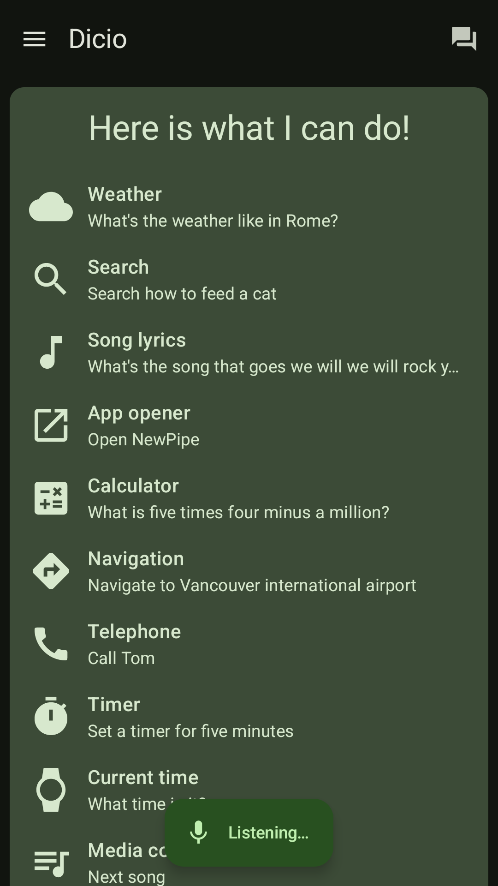
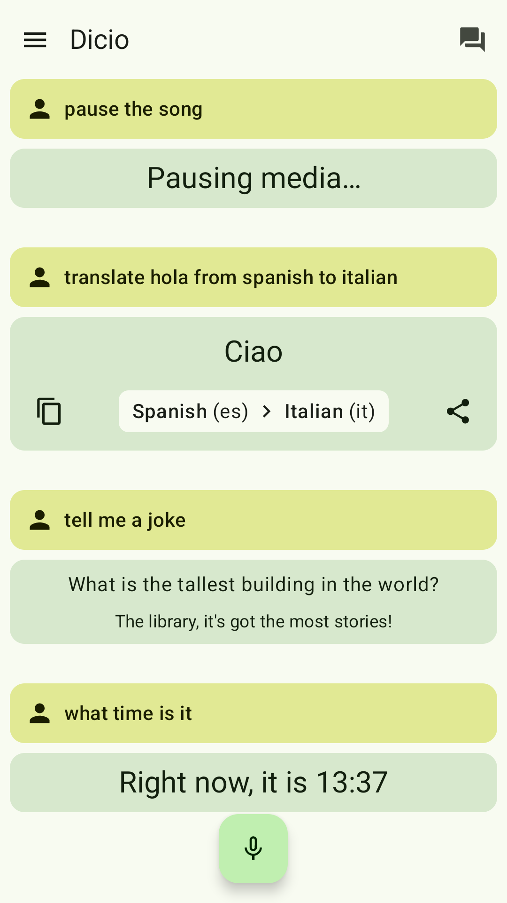

# Dicio assistant

Dicio is a *free and open source* **voice assistant** running on Android. It supports many different **skills** and input/output methods, and it provides both **speech** and **graphical** feedback to a question. It interprets user input and (when possible) generates user output entirely **on-device**, providing privacy by design. It has **multilanguage** support, and is currently available in these languages: Czech, Dutch, English, French, German, Greek, Italian, Polish, Russian, Slovenian, Spanish, Swedish and Ukrainian. Open to contributions :-D

<p align="center">
    
    &emsp;
    <a href="https://f-droid.org/packages/org.stypox.dicio">
        
    </a>
    <a href="https://github.com/Stypox/dicio-android/releases">
        
    </a>
    <a href="https://play.google.com/store/apps/details?id=org.stypox.dicio">
        
    </a>
</p>

## Screenshots

[](./fastlane/metadata/android/en-US/images/phoneScreenshots/0.png)
[](./fastlane/metadata/android/en-US/images/phoneScreenshots/1.png)
[](./fastlane/metadata/android/en-US/images/phoneScreenshots/2.png)
[](./fastlane/metadata/android/en-US/images/phoneScreenshots/3.png)
[](./fastlane/metadata/android/en-US/images/phoneScreenshots/4.png)
[](./fastlane/metadata/android/en-US/images/phoneScreenshots/4.png)

## Skills

Currently Dicio answers questions about:
- **search**: looks up information on **DuckDuckGo** (and in the future more engines) - _Search for Dicio_
- **weather**: collects weather information from **OpenWeatherMap** - _What's the weather like?_
- **lyrics**: shows **Genius** lyrics for songs - _What's the song that goes we will we will rock you?_
- **open**: opens an app on your device - _Open NewPipe_
- **calculator**: evaluates basic calculations - _What is four thousand and two times three minus a million divided by three hundred?_
- **telephone**: view and call contacts - _Call Tom_
- **timer**: set, query and cancel timers - _Set a timer for five minutes_
- **current time**: query current time - _What time is it?_
- **navigation**: opens the navigation app at the requested position - _Take me to New York, fifteenth avenue_
- **jokes**: tells you a joke - _Tell me a joke_
- **media**: play, pause, previous, next song
- **translation**: translate from/to any language with **Lingva** - _How do I say Football in German?_
- **wake word control**: turn on/off the wakeword - _Stop listening_

## Speech to text

Dicio uses [Vosk](https://github.com/alphacep/vosk-api/) as its speech to text (`STT`) engine. In order to be able to run on every phone small models are employed, weighing `~50MB`. The download from [here](https://alphacephei.com/vosk/models) starts automatically whenever needed, so the app language can be changed seamlessly.

## Contributing

Dicio's code is **not only here**! The repository with the *compiler for sentences* language files is at [`dicio-sentences-compiler`](https://github.com/Stypox/dicio-sentences-compiler), the *number parser and formatter* is at [`dicio-numbers`](https://github.com/Stypox/dicio-numbers) and the code for evaluating matching algorithms is at [`dicio-evaluation`](https://github.com/Stypox/dicio-evaluation).

When contributing keep in mind that other people may have **needs** and **views different** than yours, so please *respect* them. For any question feel free to contact the project team at [@Stypox](https://github.com/Stypox).

### Matrix room for communication

The **#dicio** channel on *Matrix* is available to get in touch with the developers: [#dicio:matrix.org](https://matrix.to/#/#dicio:matrix.org). Some convenient Matrix clients, available both for phone and desktop, are listed at that link.

### Translating

If you want to translate Dicio to a new language you have to follow these **steps**:
<ul><li>
  Translate the <b>strings used inside the app</b> via <a href="https://hosted.weblate.org/engage/dicio-android/">Weblate</a>. If your language isn't already there, add it with <a href="https://hosted.weblate.org/new-lang/dicio-android/strings/">tool -> start new translation</a>.
  </br>
  <a href="https://hosted.weblate.org/engage/dicio-android/">
  
  </a>
</li></ul>

- Translate the **sentences** used by Dicio to identify a user's request and to feed it to the correct skill. To do this open the repository root and navigate to `app/src/main/sentences/`. Copy-paste the `en` folder (i.e. the one containing English translations) and call the new folder with the 2- or 3-letter name of your language (in particular, any `ISO-639`-compliant language ID is supported). Then open the newly created folder: inside there will be some YAML files in English language. Open each one of them and translate the English content; feel free to add/remove sentences if their translation does not fit into your language and remember those sentences need to identify as better as possible what the user said. Do **NOT** change the name of the copied files, the IDs of the sentences (i.e. the `sentence_id:` before each list of sentences) or the IDs of the capturing groups (i.e. the `.ID.` construct). To learn about the Dicio sentences language syntax, please refer to the documentation and the [example](https://github.com/Stypox/dicio-sentences-compiler#example) in [`dicio-sentences-compiler`](https://github.com/Stypox/dicio-sentences-compiler#dicio-sentences-language). Hopefully in the future a custom translation system will be used for sentences.

- Once both the Weblate and the sentences translations are ready, add the new language to the app's language selector. This requires modifying two files. In the following instructions `$iso-language-id$`, `$ISO_LANGUAGE_ID$` and `$Language name$` are placeholders you should fill in, e.g. `en-in`, `EN_IN` and `English (India)`.
  1. in [app/src/main/proto/language.proto](./app/src/main/proto/language.proto#L8) add a new entry to the `Language` enum like so: `LANGUAGE_$ISO_LANGUAGE_ID$ = $increasing number$; // $Language name$`. Use the previous highest number in the enum incremented by 1 as `$increasing number$`. The position of the newly added item should make it so that the items are sorted by their language name.
  2. in [app/src/main/kotlin/org/stypox/dicio/settings/Definitions.kt](./app/src/main/kotlin/org/stypox/dicio/settings/Definitions.kt#L33) add a new item to `languageSetting.possibleValues` like so: `ListSetting.Value(Language.LANGUAGE_$ISO_LANGUAGE_ID$, "$Language name$"),`. The position of the newly added item should make it so that the items are sorted by their language name.

- Then update the app descriptions so that people know that the language you are adding is supported. The files you should edit are [README.md](./README.md) (i.e. the file you are currently viewing) and [fastlane/metadata/android/en-US/full_description.txt](./fastlane/metadata/android/en-US/full_description.txt) (the English description for F-Droid).

- Open a pull request containing both the translated sentences files, the language selector addition and the app descriptions updates. You may want to take a look at [the pull request that added German, #19](https://github.com/Stypox/dicio-android/pull/19), and if you need help don't hesitate to ask :-) 

### Adding skills

A skill is a component that enables the assistant to **understand** some specific queries and **act** accordingly. While reading the instructions, keep in mind the **javadocs** of the methods being implemented and the code of the already implemented skills. In order to add a skill to Dicio you have to follow the steps below.

<sub>`$skill_id$` and `$SkillId$` indicate the computer readable name of the skill, in snake_case and PascalCase, e.g. `weather` or `Weather`</sub>

#### 1. **Reference sentences**

The new skill most likely needs to interpret user input. The Dicio framework provides a *standard* way to define how to efficiently match user input and extract information from it, in the form of translatable reference sentences stored in YAML files. Note that *for some specific cases* the standard recognizer might not be wanted, in which case you can skip this section, and in section 3 extend `Skill<>` and implement `Skill.score()` manually, instead of extending `StandardRecognizerSkill<>`.

1. Edit the `app/src/main/sentences/skill_definitions.yml` file and add a definition for the new skill:
    ```yaml
      # The unique ID of the skill.
    - id: $skill_id$
      # `SPECIFICITY` can be `high`, `medium` or `low`.
      # It should be chosen wisely: for example, a section that matches queries
      # about phone calls is very specific, while one that matches every question
      # about famous people has a lower specificity.
      specificity: SPECIFICITY
      # A list of definitions for the types of sentences this skill can interpret.
      # Can contain multiple sentences, e.g. the timer skill has the
      # "set", "cancel" and "query" sentences.
      sentences:
          # An ID for the sentence, must be unique amongst this skill's sentences.
        - id: SENTENCE_1_ID
          # (optional) If this sentence has some capturing groups, their IDs and
          # types must be listed here.
          captures:
              # An ID for the capturing group, must be unique amongst this
              # sentence's capturing groups
            - id: CAPTURING_GROUP_1_ID
              # Currently only string capturing groups are supported, but in
              # the future "number", "duration" and "date" will also be possible.
              # For the moment use "string" and then manually parse the string to
              # number, duration or date using dicio-numbers.
              type: string
    ```

2. Create a file named `$skill_id$.yml` (e.g. `weather.yml`) under `app/src/main/sentences/en/`: it will contain the **sentences** the skill should recognize.
3. For each of the sentence definitions in `skill_definitions.yml`, write the id of each sentence type followed by `:` and a list of sentences:
    ```yaml
    SENTENCE_1_ID:
      - a<n?> sentence|phrase? alternative # ...
      - another sentence|phrase? alternative with .CAPTURING_GROUP_1_ID. # ...
      # ...
    # SENTENCE_2_ID: ... in case you have multiple sentence types
    ```
4. Write the reference sentences according to the [`dicio-sentences-language`'s syntax](https://github.com/Stypox/dicio-sentences-compiler#dicio-sentences-language).

5. Try to *build* the app: if it succeeds you did everything right, otherwise you will get errors pointing to syntax errors in the `.yml` files.

Here is an example of the weather skill definition in `skill_definitions.yml`:
```yaml
- id: weather
  specificity: high
  sentences:
    - id: current
      captures:
        - id: where
          type: string
```

And these are the example contents of `app/src/main/sentences/en/weather.yml`:
```yaml
current:
  - (what is|s)|whats the weather like? (in|on .where.)?
  - weather (in|on? .where.)?
  - how is it outside
```

#### 2. **Subpackage**
Create a **subpackage** that will contain all of the classes you are about to add: `org.stypox.dicio.skills.SKILLID` (e.g. `org.stypox.dicio.skills.weather`).

#### 3. **The Skill class**
Create a class named `$SkillId$Skill` (e.g. `WeatherSkill`): it will contain the code that interprets user input (i.e. the `score()` function) and that processes it to generate output (i.e. the `generateOutput()` function). The next few points assume that you want to use the *standard* recognizer with the skill definition and sentences you created in [step 1](#1-reference-sentences). In that case `score()` is actually already implemented and you don't need to provide an implementation yourself.

1. Have the `$SkillId$Skill` class implement `StandardRecognizerSkill<$SkillId$>`. You can import the `$SkillId$` class with `import org.stypox.dicio.sentences.Sentences.$SkillId$`. The `Sentences.$SkillId$` sealed class is generated based on `skill_definitions.yml`, and contains one subclass for each of the defined sentence types.
2. The constructor of `Skill` takes `SkillInfo` (see [step 5](#5-skillinfo)), and moreover the constructor of `StandardRecognizerSkill` takes `StandardRecognizerData<$SkillId$>` (the data generated from the sentences, see [step 5](#5-skillinfo)). You should expose these two parameters in `$SkillId$Skill`'s constructor, too.
3. Implement the following function: `override suspend fun generateOutput(ctx: SkillContext, inputData: $SkillId$): SkillOutput`. `inputData` is, again, an instance of `Sentences.$SkillId$` corresponding to the matched sentence type, and its fields contain type-safe information about the data captured in capturing groups (if any).
4. Any code making *network requests or heavy calculations* should be put in `generateOutput` (which is a suspend function for this exact purpose). The returned `SkillOutput` should contain all of the data needed to actually show the output, i.e. it shouldn't do any more network requests or calculations (unless it's an interactive widget and the user presses some button, but that's not too relevant for the matter at hand).

This is a stub implementation of the `WeatherSkill`:

```kotlin
package org.stypox.dicio.skills.weather
import org.stypox.dicio.sentences.Sentences.Weather
// ...
class WeatherSkill(correspondingSkillInfo: SkillInfo, data: StandardRecognizerData<Weather>) :
    StandardRecognizerSkill<Weather>(correspondingSkillInfo, data) {
    override suspend fun generateOutput(ctx: SkillContext, inputData: Weather): SkillOutput {
      return // ...
    }
}
```

#### 4. **SkillOutput**

Create a class named `$SkillId$Output` (e.g. `WeatherOutput`): it will contain the code that creates a Jetpack Compose UI and provides speech output.

1. The class should be constructed by `Skill.generateOutput()` with all of the data needed to display/speak output, and is meant to be serializable (so in most cases it is a `data class`). In some cases it might make sense to have multiple types of output (e.g. the weather has `Success` and `Failed` output types): in that case you can create a `sealed interface` and have both output types extend it.
2. `getSpeechOutput()` returns a localized string that will be spoken via the configured Text To Speech service.
3. `@Composable GraphicalOutput()` builds the UI that will be shown in a box on the home screen. The UI can be interactive and can act as a widget: for example the timer skill shows the ongoing countdown.
4. _\[Optional\]_ `getNextSkills()` returns a list of skills that could continue the current conversation. If this list is non-empty, the next time the user asks something to the assistant, these skills will be considered before all other skills, and if any of these skills understands the user input well enough, the conversation continues. For example, if the user says "Call Mom", the assistant may answer with "Should I call mom?" and this method would return a skill that can understand a yes/no response.

This is a stub implementation of `WeatherOutput`:
```kotlin
data class WeatherOutput(
    val city: String,
    val description: String,
    // ...
) : WeatherOutput {
    override fun getSpeechOutput(ctx: SkillContext): String = ctx.getString(
        R.string.skill_weather_in_city_there_is_description, city, description
    )

    @Composable
    override fun GraphicalOutput(ctx: SkillContext) {
        // Jetpack Compose UI
    }
}
```

#### 5. **SkillInfo**
Create an `object` named `$SkillId$Info` (e.g. `WeatherInfo`) overriding `SkillInfo`: it will contain all of the **information needed to manage your skill**.
1. This is not a class, but an `object`, because it makes no sense to instantiate it multiple times.
2. Call the `SkillInfo` constructor with the `"$skill_id$"` string.
3. Provide sensible values for `name()`, `sentenceExample()` and `icon()`.
4. Override the `isAvailable()` method and return whether the skill can be used under the *circumstances* the user is in (e.g. check whether the recognizer sentences are translated into the user language with `Sentences.$SkillId$[ctx.sentencesLanguage] != null` (see [step 1](#1-reference-sentences) and step 5.5) or check whether `ctx.parserFormatter != null`, if your skill uses number parsing and formatting).
5. Override the `build()` method so that it returns an instance of `$SkillId$Skill` with `$SkillId$Info` as `correspondingSkillInfo` and, if the skill uses standard recognizer sentences (see [step 1](#1-reference-sentences)), with `Sentences.$SkillId$[ctx.sentencesLanguage]` as `data`.
4. _\[Optional\]_ If your skill wants to present some preferences to the user, it has to do so by overriding the `renderSettings` value (which by default returns `null` to indicate there are no preferences).

#### 6. **List skill inside SkillHandler**
Under `org.stypox.dicio.Skills.SkillHandler`, update the `allSkillInfoList` by adding `$SkillId$Info`; this will make the new skill finally visible to Dicio.

#### **Notes**
- The `ctx: SkillContext` object, that appears here and there in the implementation, allows accessing the Android context, the number parser/formatter and other **resources** and services, similarly to Android's `context`.
- The **names** used for things (files, classes, packages, sections, etc.) are not mandatory, but they help **avoiding confusion**, so try to stick to them.
- When committing changes about a skill, prefix the commit message with "[\$SkillId\$]", e.g. "[Weather] Fix crash".
- Add your skill with a short description and an example in the README under [Skills](https://github.com/Stypox/dicio-android#skills) and in the [fastlane's long description](https://github.com/Stypox/dicio-android/tree/master/fastlane/metadata/android/en-US/full_description.txt).
- If you have any question, **don't hesitate** to ask. 😃
