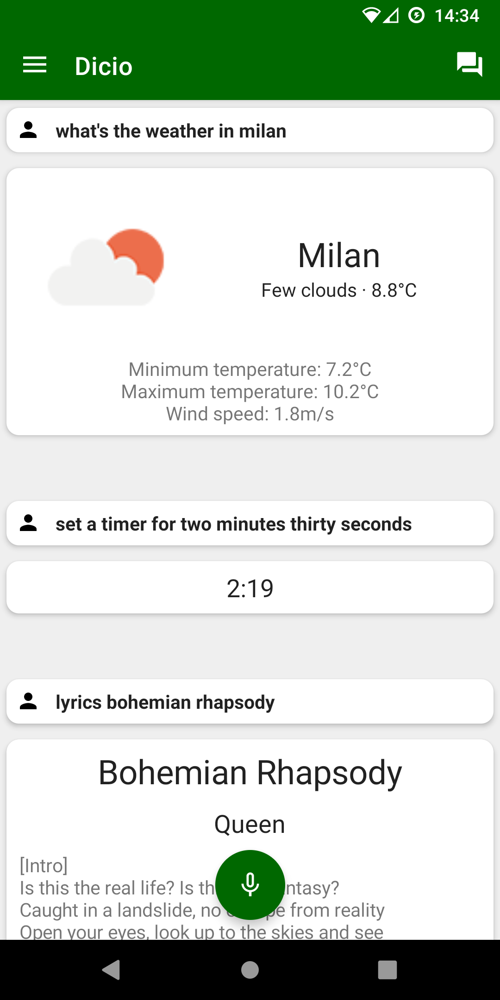
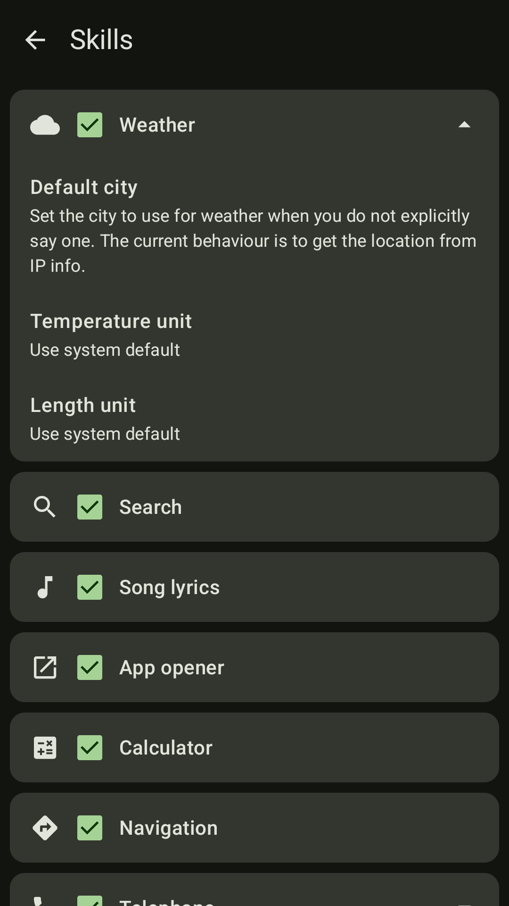

# Dicio assistant

Dicio is a *free and open source* **voice assistant** running on Android. It supports many different **skills** and input/output methods, and it provides both **speech** and **graphical** feedback to a question. It uses [Vosk](https://github.com/alphacep/vosk-api/) for *speech to text*. It has multilanguage support, and is currently available in these languages: English (`en`) and Italian (`it`). Open to contributions :-D

## Skills

Currently Dicio answers questions about:
- **search**: looks up information on **Qwant** or **DuckDuckGo** - _Search for Dicio_
- **weather**: collects weather information from **OpenWeatherMap** - _What's the weather like?_
- **lyrics**: shows **Genius** lyrics for songs - _What's the song that goes we will we will rock you?_
- **open**: opens an app on your device - _Open NewPipe_
- **calculator**: evaluates basic calculations - _What is four thousand and two times three minus a million divided by three hundred?_

## Speech to text

Dicio uses [Vosk](https://github.com/alphacep/vosk-api/) as its speech to text (`STT`) engine. In order to be able to run on every phone small models are employed, weighing `~50MB`. The download from [here](https://alphacephei.com/vosk/models) starts automatically whenever needed, so the app language can be changed seamlessly.

## Contributing

Dicio's code is not only here! The repository with the compiler for sentences language files is at [`dicio-sentences-compiler`](https://github.com/Stypox/dicio-sentences-compiler) and the repository which takes care of input matching and provides skill interfaces is at [`dicio-skill`](https://github.com/Stypox/dicio-skill)

### Translating

If you want to translate Dicio to a new language you have to take these **steps**:
<ul><li>
  Translate the <b>strings used inside the app</b> via <a href="https://hosted.weblate.org/engage/dicio-android/">Weblate</a>. If your language isn't already there, add it with <a href="https://hosted.weblate.org/new-lang/dicio-android/strings/">tool -> start new translation</a> then add it to the app's language selector (the instructions for this are similar to <a href="https://github.com/TeamNewPipe/NewPipe/wiki/How-to-add-a-new-language-to-NewPipe#add-it-to-the-language-selector">NewPipe's</a>, don't hesitate to ask for help).
   
  
</li></ul>

- Translate the **sentences** used by Dicio to identify a user's request and to feed it to the correct skill. To do this open the repository root and navigate to `app/src/main/sentences/`. Copy-paste the `en` folder (i.e. the one containing English translations) and call the new folder with the 2- or 3-letter name of your language (in particular, any `ISO-639`-compliant language ID is supported). Then open the newly created folder: inside there should be some files with the `.dslf` extension and in English language. Open each one of them and translate the English content; feel free to add/remove sentences if their translation does not fit into your language and remember those sentences need to identify as better as possible what the user said. Do **NOT** edit the name of the copied files or the first line in them (i.e. the `ID: SPECIFICITY` line, like `weather: high`): they should remain English. To learn about the Dicio sentences language syntax, please refer to the documentation and the [example](https://github.com/Stypox/dicio-sentences-compiler#example) in [`dicio-sentences-compiler`](https://github.com/Stypox/dicio-sentences-compiler#dicio-sentences-language). Hopefully in the future a custom translation system will be used for sentences.

### Adding skills

###### TODO: add description
